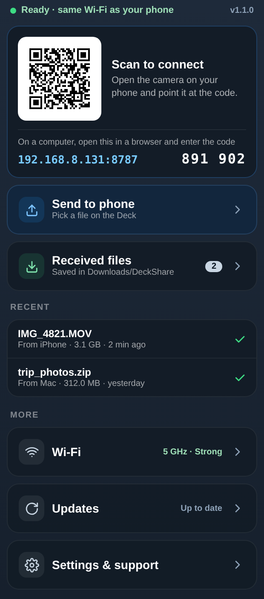
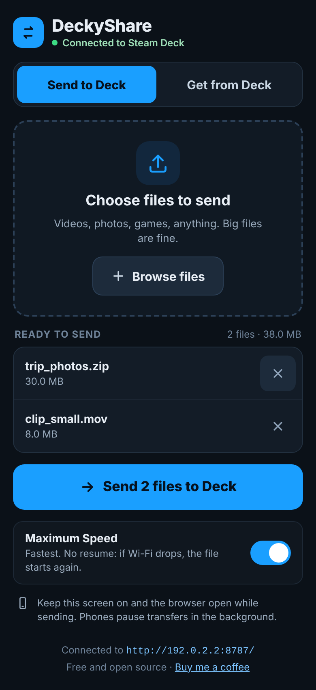

# DeckyShare

**Share files with your Steam Deck. Simple. Wireless. Fast.**

DeckyShare is a Decky Loader plugin for two-way file transfer between a Steam
Deck and a phone or computer on the same Wi-Fi. No app is needed on the phone
or computer: it works in any browser.

<p>


</p>

## Features

- **Phone / computer → Deck**: pick one or many files in the browser; they are saved in `~/Downloads/DeckShare/`.
- **Deck → phone / computer**: pick a file in Gaming Mode and download it in the browser.
- **Screenshots**: pick Steam screenshots in Gaming Mode and save them on your phone from a gallery.
- **Clipboard**: send text and links between phone/PC and Deck, with one-tap Copy and Open.
- **Game clips of any length**: turn Steam game recordings into MP4 in Gaming Mode and send them to your phone (Steam's own share is limited to 59 seconds).
- **Connect in seconds**: scan the QR code with a phone, or open the short address on a computer and type the 6-digit code shown on the Deck.
- **Big files**: live speed, time left, and a warning when a transfer stalls. Maximum Speed mode, plus resumable Turbo/Fast modes that survive short Wi-Fi drops.
- **Cancel from either side**, including from the Deck panel.
- **Gaming Mode file manager**: browse, copy, move, rename, new folder, move to trash, all with the controller.
- **Wi-Fi check**: shows the Deck's band, link speed and signal, with hints when the Wi-Fi is the bottleneck.
- **Built-in updates**: DeckyShare checks its GitHub releases and installs verified updates through Decky.

## Install

DeckyShare is installed manually (it is not in the official Decky store).

1. Install [Decky Loader](https://decky.xyz) if you have not already.
2. In Gaming Mode open Decky (Quick Access → plug icon) → **Settings** (gear) → **General** and turn on **Developer mode**.
3. Go to **Developer** → **Install Plugin from URL** and paste:
   ```
   https://github.com/gillrajvir950-wq/deckyshare/releases/latest/download/DeckyShare.zip
   ```
   Or download the latest `DeckyShare-v….zip` from [Releases](https://github.com/gillrajvir950-wq/deckyshare/releases/latest) and use its link.
4. Open DeckyShare from the Decky menu.

From then on, open **More → Updates** in the DeckyShare panel to install new versions.

Advanced: a self-hosted custom Decky store is available in [`store/`](store/).

## Use

**Phone:** scan the QR code in the DeckyShare panel with the camera. The page
opens in the browser: **Send to Deck** to upload, **Get from Deck** to download
the file you picked in the panel (**Send to phone**).

**Computer:** open the address shown in the panel (for example
`192.168.8.131:8787`) in any browser and enter the 6-digit code.

Keep the phone's screen on with the browser open while sending: phones pause
transfers in the background.

## Speed tips

Transfers go phone → router → Deck over Wi-Fi, so the Wi-Fi link sets the speed.

- Use the router's **5 GHz** network and stay reasonably close to it. The panel's **More → Wi-Fi** shows the Deck's band and signal.
- A weak signal (around −70 dBm or worse) can cut speed to 3–5 MB/s; next to the router 20+ MB/s is typical.
- For the fastest transfers connect the Deck with a USB-C Ethernet adapter.

## Security

- DeckyShare listens on your local network only while Decky runs.
- Every phone/computer needs the session token from the QR code, or a one-time 6-digit code (expires after 10 minutes, rate limited).
- Use it on networks you trust (home Wi-Fi), not on public Wi-Fi.
- **Upgrade from v1.0.0**: v1.0.0 had no access protection. Install v1.1.0 or later.

## Support

If DeckyShare is useful to you, you can support development on
[Buy Me a Coffee](https://buymeacoffee.com/Gillrv).

## License

MIT. See [LICENSE](LICENSE). DeckyShare bundles `python-qrcode` (MIT).

## Disclaimer

DeckyShare is an independent community project and is not affiliated with or
endorsed by Valve or Decky Loader. Parts of DeckyShare were developed with the
help of AI coding assistants.
